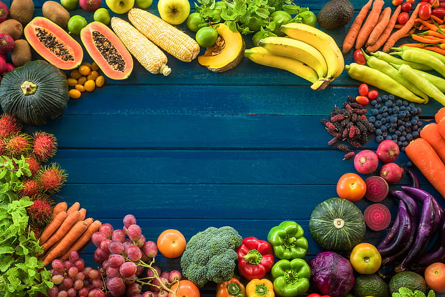

```{r setup, include=FALSE}
knitr::opts_chunk$set(echo = FALSE)
```

Have you ever wondered which fruits and vegetables are the most and least expensive? 

This project explores the retail prices of fruits and vegetables in different forms. Using the 2022 fruit and vegetable price datasets, we compared retail prices, cup equivalent prices, and average prices by market form.

The goal was to identify any possible differences between fruit and vegetable prices according to the form they were sold in. 



*** 

```{r message = F, warning = F}

library(ggplot2)
library(dplyr)
library(kableExtra)

VegetableData <- read.csv("Vegetable-Prices-2022.csv")
FruitData <- read.csv("Fruit-Prices-2022.csv")

FruitPriceperYield <- FruitData %>% select("Fruit", "Form", "RetailPrice", "RetailPriceUnit", "Yield") %>% mutate(RetailPriceperYield = RetailPrice * Yield)

CupEquivalentData <- FruitData %>% select(Fruit, Yield, CupEquivalentSize, CupEquivalentUnit, CupEquivalentPrice) %>% mutate(YieldPerCup = Yield / CupEquivalentSize) %>% mutate(PricePerCup = YieldPerCup * CupEquivalentPrice)

glimpse(FruitData)
glimpse(VegetableData)
```

***

```{r}

FruitData %>% select(Fruit, Form, CupEquivalentPrice) %>% arrange(-CupEquivalentPrice) %>%   knitr::kable() %>% kable_styling() %>% scroll_box(width = "750px", height = "500px")
```

According to the data shown:

* Canned cherries, packed in syrup or water were the most expensive fruit at $3.558 per cup. 

* Fresh watermelons were the least expensive at $0.2429 per cup. 

*** 


```{r}
AveragePriceperForm <- FruitData %>% group_by(Form) %>% summarise(AveragePrice = mean(RetailPrice, na.rm = TRUE))

AveragePriceperForm %>% ggplot(aes(x = Form, y = AveragePrice)) + geom_col() + labs(title = "Average Retail Price per Market (Form)", x = "Market Form", y = "Average Price ($)") + theme_minimal()
```

* Dried market form showed an overall higher average price.

* Fruit juice showed the overall lowest average price. 

* Canned and fresh fruit showed a similar average price. 

***
```{r}
FruitData %>% ggplot(aes(x = Form, y = RetailPrice)) + geom_boxplot()

```
* Dried fruits showed a higher average price per cup range. 

* Fresh showed a greater amount of outliers.

* Juice showed the lowest average price per cup range. 

***

```{r}
VegetablePriceperYield <- VegetableData %>% select("Vegetable", "Form", "RetailPrice", "RetailPriceUnit", "Yield") %>% mutate(RetailPriceperYield = RetailPrice * Yield)

VegetableCupEquivalentData <- VegetableData %>% select(Vegetable, Yield, CupEquivalentSize, CupEquivalentUnit, CupEquivalentPrice) %>% mutate(YieldPerCup = Yield / CupEquivalentSize) %>% mutate(PricePerCup = YieldPerCup * CupEquivalentPrice)

```

```{r}

VegetableData %>% select(Vegetable, Form, CupEquivalentPrice) %>% arrange(-CupEquivalentPrice) %>%   knitr::kable() %>% kable_styling() %>% scroll_box(width = "750px", height = "500px")
```

 According to the data shown:

* Fresh asparagus were the most expensive vegetable at $2.6191 per cup. 

* Dried pinto beans were the least expensive at $0.2215 per cup. 

***

```{r}

VegAveragePriceperForm <- VegetableData %>% group_by(Form) %>% summarise(AveragePrice = mean(RetailPrice, na.rm = TRUE))

VegAveragePriceperForm %>% ggplot(aes(x = Form, y = AveragePrice)) + geom_col() + labs(title = "Average Retail Price per Market (Form)", x = "Market Form", y = "Average Price ($)") + theme_minimal()
```

* Frozen vegetables showed a higher average price range. 

* Canned vegetables showed the least average price range.

* The average price range was very narrow with a maximum difference of $1 between vegetable prices, based on their market form. 

***

```{r}
VegetableData %>% ggplot(aes(x = Form, y = RetailPrice)) + geom_boxplot()

```

* Fresh vegetables showed a greater range in price per cup. 

* Canned showed a smaller range but had outliers that were had a higher average retail price per cup.

***

```{r}
fruit_avg <- FruitData %>%

summarize(AveragePrice = mean(RetailPrice)) %>%

mutate(Category = "Fruit")


veg_avg <- VegetableData %>%

summarize(AveragePrice = mean(RetailPrice)) %>%

mutate(Category = "Vegetable")


compare_avg <- rbind(fruit_avg, veg_avg)


ggplot(compare_avg, aes(x = Category, y = AveragePrice, fill = Category)) +

geom_bar(stat = "identity", width = 0.5) +

labs(title = "Average Price: Fruits vs Vegetables", x = "Category", y = "Average Price ($)") +

theme_minimal()
```

* Overall, fruit showed a higher average price per category compared to vegetables per cup. 

* This suggested a higher spending on price per cup when purchasing fruit compared to vegetables. 

***

```{r}
fruit_avg <- FruitData %>% group_by(Form) %>% summarize(AveragePrice = mean(RetailPrice))
veg_avg <- VegetableData %>% group_by(Form) %>% summarize(AveragePrice = mean(RetailPrice))


fruit_avg$Category <- "Fruit"
veg_avg$Category <- "Vegetable"


compare_avg <- rbind(fruit_avg, veg_avg)


ggplot(compare_avg, aes(x = Form, y = AveragePrice, fill = Category)) +
  geom_bar(stat = "identity", position = "dodge") +
  labs(title = "Average Price by Form: Fruits vs Vegetables", x = "Form", y = "Average Price ($)") +
  theme_minimal() +
  coord_flip()
```

* **Juice:** Vegetables prices were not affected since data was not provided for vegetables in this specific form. 

* **Frozen:** About a $2 difference in average price was shown between the categories. 

* **Fresh:** The average price showed very little difference.

* **Dried:** Showed the largest difference in average price of almost $5. 

* **Canned:** Showed a relatively small difference. 

***

What are the best choices for a tight budget (under $5.00, for example)?


***

If someone wanted to buy 5 cups of produce on a $3 budget, what combinations would work?

```{r}
FruitDataUnder3 <- FruitData %>% mutate(Priceper5cups = 5 * CupEquivalentPrice) %>% filter(Priceper5cups < 3)

VegetabledataUnder3 <- VegetableData %>% mutate(Priceper5cups = 5 * CupEquivalentPrice) %>% filter(Priceper5cups < 3) 

FruitDataUnder3 %>% select(Fruit, Form, Priceper5cups) %>% arrange(-Priceper5cups) %>%   knitr::kable() %>% kable_styling() %>% scroll_box(width = "750px", height = "500px")

```

*** 

```{r}
VegetabledataUnder3 %>% select(Vegetable, Form, Priceper5cups) %>% arrange(-Priceper5cups) %>%   knitr::kable() %>% kable_styling() %>% scroll_box(width = "750px", height = "500px")
```

*** 

There are only 13 fruit options and 29 vegetable options to fit this scenario. 

Some Examples of what produce you would have been able to buy in this scenario are:

* Canned Carrots for $2.9460 
* Dried Pinto beans for $1.1075
* Grapefruit Juice for $2.9840
* Fresh Watermelon for $1.2145
